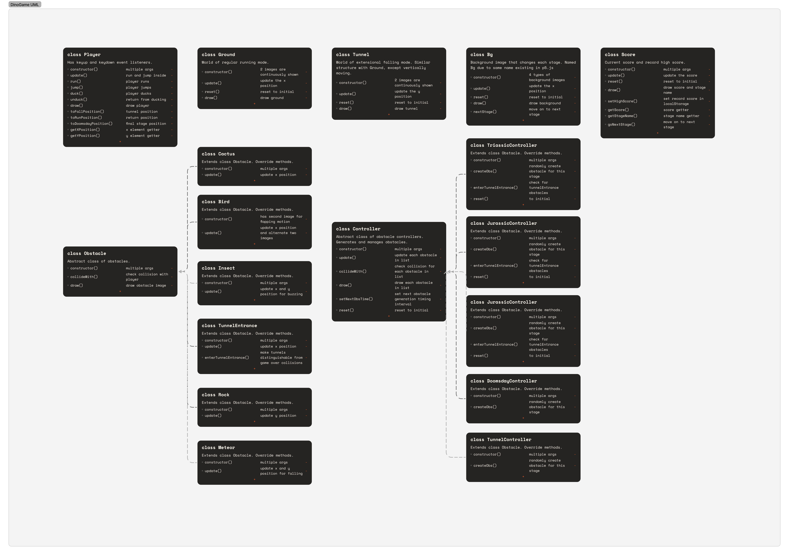

# Individual Project

- Name: Ryu Ihchae
- ID: 20200216
- Email: ihchaeryu@kaist.ac.kr
- Git repo: https://github.com/ihchaeryu/RunForYourLifeDino
- Demo video: https://youtu.be/7NNCsQd-Pdo

---

## Game Description

My Game, "Run For Your Life Dino" is an extended version of the well known chrome Dino game. Instead of the never-ending obstacle-avoiding running game as the original version is, I made it so that it has a short story, with a few stages and a clear ending. 

The main goal of the user is to help the Dino, which is the player, escape the great extinction. That is what Dino is running away for. Dino goes through the dinosaur era, which consists of 3 stages(each being the Triassic, Jurassic, and the Cretaceous era), tries to survive the final special stage(which is the aka "doomsday"), and finally escape the extinction completely. The stages move on one after another when the score exceeds each stage threshold. On each stage, Dino has to avoid collision with various types of obstacles.

In practice, the user controls the Dino with keyboard keys. The space key is mostly used for jumping, and arrow keys for sideways movement or ducking down. 

 

## Code Organization

 

## Help and Resource

- [Online tutorial](https://youtu.be/ooru4pyEv1I) implementing the basic version of the Dinosaur Game.